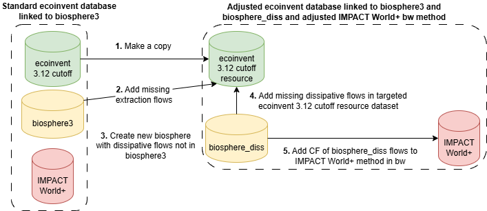

# metalinvent
metalinvent: a brightway2 compliant tool to adjust abiotic resource flows in ecoinvent metal ore mining activities and waste treatment activities

This python tool allows to add missing extraction flows and dissipative flows in targeted ecoinvent datasets, namely ore mining activities and waste treatment activities.
When some dissipative flows are not included in the biosphere3 brightway database, it creates a new biosphere_resource database with new flows, include those flows in targeted activities and include IMPACT World+ version 2.2.1 characterization factors for flows in biosphere_resource.

# Methods

Two methods are proposed and differ for ore mining activities only (similar for waste treatment activities):
- Method 1: Assume that metal emissions from tailings activities called as input to ore mining activities is consistent with ore mined in the activity. It apply the mass-balance principles by calculating missing extraction flows by substracting total extraction of element e (e.g. copper) by the sum of copper emitted to the environment (direct emission in ore mining activity + emissions from tailing management activities). The resulting negative value meaning extraction is inferior to total emissions to environment is added as missing extraction (positive value).
- Method 2: Assume that the tailing activity called as input to ore mining activity is inconsistent with ore mined in the activity, based on a comparison of reported byproducts by mining companies gathered in Greffe et al. [(2024)](https://doi.org/10.1021/acs.est.4c05293) database and with reported metals emissions from tailings management activities called as input to ore mining activities. It therefore derive byproduct extraction and resulting dissipation (since byproduct are considered as waste by the mining company, see Greffe et al. [(2024)](https://doi.org/10.1021/acs.est.4c05293)) using available byproduct-to-host ratios from Greffe et al. [(2024)](https://doi.org/10.1021/acs.est.4c05293) as follows:

$$
  Extraction_{b} = Extraction_{h} \cdot BtH_{b,h}
$$

For byproducts, dissipation is assumed equal to extraction.

### Requirements
ecoinvent license to download ecoinvent 3.12 cutoff database.

# Author
Titouan Greffe (greffe.titouan@uqam.ca)
# Reference
Greffe, T., Agez M., Margni, M., Bulle, C. (2026) No abiotic resource flows, no impacts? Scrutinizing hidden potential impact of unreported extraction and dissipative flows in ecoinvent life cycle inventory database. _under preparation_
